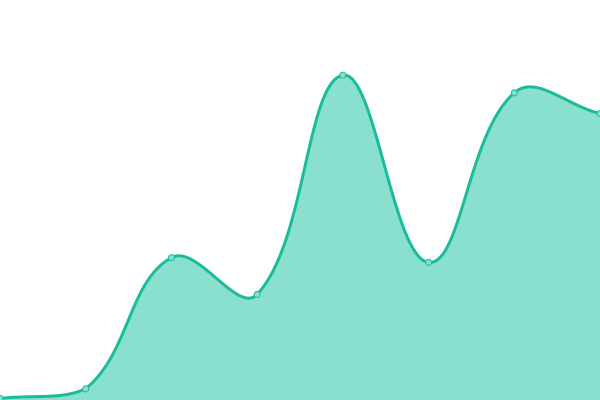

# [📈 Live Status](https://manthanank.github.io/uptime): <!--live status--> **🟩 All systems operational**

This repository contains the open-source uptime monitor and status page for [Upptime](https://upptime.js.org), powered by [Upptime](https://github.com/upptime/upptime).

With [Upptime](https://upptime.js.org), you can get your own unlimited and free uptime monitor and status page, powered entirely by a GitHub repository. We use [Issues](https://github.com/upptime/upptime/issues) as incident reports, [Actions](https://github.com/manthanank/upptime/actions) as uptime monitors, and [Pages](https://manthanank.github.io/uptime) for the status page.

<!--start: status pages-->
<!-- This summary is generated by Upptime (https://github.com/upptime/upptime) -->
<!-- Do not edit this manually, your changes will be overwritten -->
<!-- prettier-ignore -->
| URL | Status | History | Response Time | Uptime |
| --- | ------ | ------- | ------------- | ------ |
|  [Portfolio](https://manthanank.github.io) | 🟩 Up | [portfolio.yml](https://github.com/manthanank/uptime/commits/HEAD/history/portfolio.yml) | 

 97ms
     
 | 

<a href="https://manthanank.github.io/uptime/history/portfolio">100.00%</a>
    

|  [Full Stack Portfolio](https://manthanank.web.app) | 🟩 Up | [full-stack-portfolio.yml](https://github.com/manthanank/uptime/commits/HEAD/history/full-stack-portfolio.yml) | 

 250ms
     
 | 

<a href="https://manthanank.github.io/uptime/history/full-stack-portfolio">100.00%</a>
    

|  [JavaScript Projects](https://manthanank.github.io/javascript-projects) | 🟩 Up | [java-script-projects.yml](https://github.com/manthanank/uptime/commits/HEAD/history/java-script-projects.yml) | 

 188ms
     
 | 

<a href="https://manthanank.github.io/uptime/history/java-script-projects">100.00%</a>
    

|  [Learn JavaScript](https://manthanank.github.io/learn-javascript) | 🟩 Up | [learn-java-script.yml](https://github.com/manthanank/uptime/commits/HEAD/history/learn-java-script.yml) | 

 217ms
     
 | 

<a href="https://manthanank.github.io/uptime/history/learn-java-script">100.00%</a>
    

|  [Learn Angular](https://learn-angular-app.vercel.app) | 🟩 Up | [learn-angular.yml](https://github.com/manthanank/uptime/commits/HEAD/history/learn-angular.yml) | 

 28ms
     
 | 

<a href="https://manthanank.github.io/uptime/history/learn-angular">100.00%</a>
    

<!--end: status pages-->

[**Visit our status website →**](https://manthanank.github.io/uptime)

## 📄 License

- Powered by: [Upptime](https://github.com/upptime/upptime)
- Code: [MIT](./LICENSE) © [Upptime](https://upptime.js.org)
- Data in the `./history` directory: [Open Database License](https://opendatacommons.org/licenses/odbl/1-0/)
